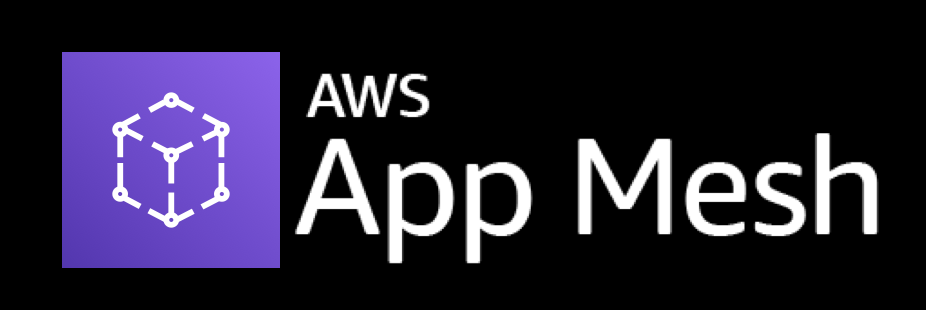

# 

A curated list of guides, development tools, and resources for [Amazon App Mesh](https://aws.amazon.com/app-mesh/). This list includes both community created content as well as content created by AWS.

_Want to add something? Open a PR!_ 🙂

### Pick your service mesh:

- <a href="#aws-appmesh">AWS App Mesh</a> - AWS App Mesh is a service mesh that provides application-level networking to make it easy for your services to communicate with each other across multiple types of copute infrastructure. App Mesh standardizes how your services communicate, giving you end-to-end visiblity and ensureing high-availability for your applications.

- <a href="#istio">Istio for Kubernetes</a> - Istio is the most popular service mesh for the Kubernetes community.

- <a href="#linkerd">Linkerd for Kubernetes</a> - Linkerd service mesh.

- <a href="#envoy">Envoy</a> - Most service meshes are based upon Envoy. This section discusses Envoy capabilities, and mentions some Envoy based tools and products.
 

## AWS App Mesh

- [Jeff Barr blog](https://aws.amazon.com/blogs/aws/aws-app-mesh-application-level-networking-for-cloud-applications/) - Jeff Barr's blog on App Mesh.
- [Werner's blog](https://www.allthingsdistributed.com/2019/03/redefining-application-communications-with-aws-app-mesh.html) - Werner Vogels thoughts on redefining application communications.
- [Introducing App Mesh](https://aws.amazon.com/blogs/compute/introducing-aws-app-mesh-service-mesh-for-microservices-on-aws/) - Service Mesh for microservices on AWS blog post.
- [App Mesh Roadmap](https://github.com/aws/aws-app-mesh-roadmap) - Public roadmap.
- [App Mesh Preview channel](https://docs.aws.amazon.com/en_pv/app-mesh/latest/userguide/preview.html) - New features of App Mesh are released on a preview channel, available only in us-west-2.
- [Introductory Video](https://www.youtube.com/watch?v=1UDRGlmbiZA&feature=youtu.be) - An overview of AppMesh
- [Service Mesh Video](https://www.youtube.com/watch?v=hfzWtXKrv88) - An overview of numerous service meshes, and how to get started with App Mesh on AWS.
- [Monitoring App Mesh with DataDog](https://www.datadoghq.com/blog/envoy-app-mesh-monitoring/) - How to monitor App Mesh using DataDog
- [X-Ray and App Mesh](https://aws.amazon.com/blogs/compute/integrating-aws-x-ray-with-aws-app-mesh/) - Leverging App Mesh with X-Ray for improved visiblity.
- [App Mesh examples](https://github.com/aws/aws-app-mesh-examples/tree/master/walkthroughs) - The official repository of AWS App Mesh examples.
- [App Mesh overview](https://itnext.io/aws-app-mesh-service-mesh-for-microservices-running-on-aws-3f667f005d6a) - A blog discussing the various App Mesh components for both EKS and ECS.
- [Service Mesh the easy way with AWS App Mesh and SuperGloo](https://medium.com/solo-io/service-mesh-the-easy-way-with-aws-app-mesh-and-supergloo-5f2c1e0f443f) - SuperGloo simplifies Service Mesh experience by providing an abstraction layer for all common service meshes including App Mesh, ISTIO, Linkerd. SuperGloo is targeted at Kubernetes.
- [App Mesh integrstion with nginx Ingress](https://github.com/walkley/appmesh-ingress-example) - This repository illustrates how to setup Ingress-nginx with AWS App Mesh, using the example _color_app_.

### App Mesh for ECS

- [Documentation](https://docs.aws.amazon.com/en_pv/app-mesh/latest/userguide/mesh-getting-started-ecs.html) - This topic helps you to use AWS App Mesh with an existing set of microservice applications running on Amazon ECS.
- [Appmesh on ECS using CDK](https://github.com/nathanpeck/greeter-app-mesh-cdk) - An example of how to use AWS Cloud Development Kit to setup an AWS App Mesh service mesh in AWS Elastic Container Service 
- [Voter App demo](https://github.com/aws-samples/voteapp) - An example of how to use App Mesh with a typical micro-service application.
- [Canary Deployments using App Mesh on Fargate](https://hackernoon.com/perform-canary-deployments-with-aws-app-mesh-on-amazon-ecs-fargate-3l3lo3zf8) - In this article, I will walk you through all the steps required to perform canary deployments on Amazon ECS / Fargate with AWS App Mesh.

### App Mesh for Kubernetes

- [Tutorial for App Mesh on K8](https://docs.aws.amazon.com/en_pv/app-mesh/latest/userguide/mesh-k8s-integration.html) - The official tutorial for App Mesh on Kubernetes.
- [Learning App Mesh on Kubernetes](https://aws.amazon.com/blogs/compute/learning-aws-app-mesh/) - A tutorial on setting up App Mesh on Kubernetes.
- [Installing Flagger on EKS](https://github.com/weaveworks/flagger/blob/master/docs/gitbook/install/flagger-install-on-eks-appmesh.md) - Flagger is a CRD which executes automatic canary deployments for Kubernetes via a service mesh.

### App Mesh for EC2

- [App Mesh on EC2](https://docs.aws.amazon.com/en_pv/app-mesh/latest/userguide/mesh-getting-started-ec2.html) - This topic helps you to use AWS App Mesh with an existing microservice application running on Amazon EC2 instances. 

### ISTIO

- [Getting started with Istio on Amazon EKS](https://aws.amazon.com/blogs/opensource/getting-started-istio-eks/) - A blog showing how to run Istio on EKS.
- [Observe your service mesh with Kiali](https://aws.amazon.com/blogs/opensource/observe-service-mesh-kiali/) - A follow up to the previous blog, on how to get rich visiblity graphics using the open-source tool Kiali.
- [The service mesh era](https://services.google.com/fh/files/misc/the_service_mesh_era_architecting_securing_and_managing_microservices_with_istio_white_paper.pdf) - A Google whitepaper discussing "Architecting, Securring and MAnaging Microservices with Istio"
- [Debugging Istio](https://www.youtube.com/watch?v=FbYBO7Pi2d8) - A video by some Google engineers describing how to debug an istio service mesh.
- [Fixing bugs with a service mesh](https://www.youtube.com/watch?v=9CQ0PMiOGhg) - How to leverage a service mesh to find and fix bugs.
- [Canary deployments, dynamic routing and tracing](https://blog.aquasec.com/istio-service-mesh-traffic-control) - The last of a series of posts explaining istio and its security features.
- [Introduction to Istio blog series](https://developers.redhat.com/topics/service-mesh/) - This is a 10 part blog series by RedHat on Istio for Kubernetems/OpenShift.

### Linkerd

- [Linkerd on AWS](https://github.com/HansNesbitt/linkerd-on-eks) - This github repo describes how to run Linkerd on AWS.

### Envoy

### Reference Architectures
